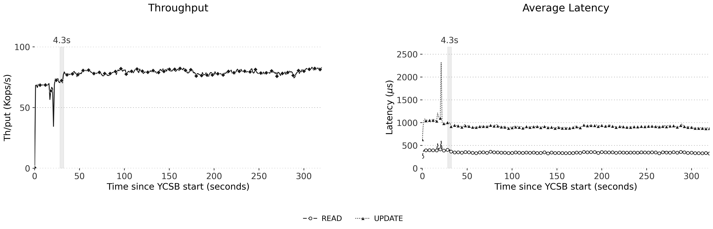
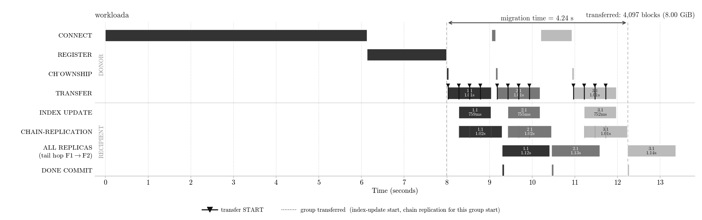
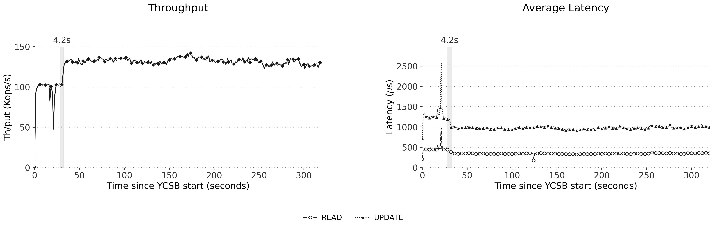

# AqRaft 30M Reshard — Background-Merge Experiment Summary

30M-key RDMA reshard (25% of slots migrated to sg4), background merge ON, **4 backpatch
pool workers**, `n_rounds=1`, `rdma_transfer_chunk_slots=342`. Two YCSB workloads.
Validated 2026-07-06. Branch `aqueduct_broken`.

---

## Transfer / chunk breakdown

The migration moves **8.00 GiB** (4,097 blocks × 2 MiB) = the recipient's share of the
keyspace (~7.49M key-value pairs). Each donor ships its full range as **4 chunks**;
each 2 MiB block holds one slot's keys.

| Quantity | Value |
|---|---|
| Donors (source shard groups) | 3 (sg1, sg2, sg3) |
| **Chunks per donor session** | **4** (`342 + 342 + 342 + 339` slots = 1,365 slots) |
| **Total chunks** (1 round × 3 donors × 4) | **12** |
| Slots per chunk | 342 (last chunk 339) |
| **Chunk size on the wire** | **684 MiB** (342 slots × 2 MiB); last chunk 678 MiB |
| **Keys per chunk** | **~626,000** (342 slots × ~1,830 keys/slot) |
| Keys per donor session (4 chunks) | ~2.50M |
| Total keys migrated | ~7.49M (= moved + skipped, exact) |
| Keys per slot | ~1,830 (30M ÷ 16,384) |

### Transfer rate (GBit/sec)

Chunks land ~**252 ms apart** (measured: seq0→1→2→3 at 02.289 → 02.541 → 02.793 → 03.042):

| Measure | Rate |
|---|---|
| **Per chunk / per-donor RDMA stream** | **~22.7 Gbit/s** (684 MiB ÷ 0.252 s = 2.64 GiB/s) |
| Aggregate (8.00 GiB over the transfer span) | ~11–13 Gbit/s (donors staggered by xsession) |

> The per-stream rate is chunk-size-independent: doubling `chunk_slots` (171→342) also
> doubled the inter-chunk gap (126→252 ms), so raw RDMA write bandwidth per stream is
> unchanged (~22.7 Gbit/s). Chunk size is a pipeline-granularity knob, not a bandwidth
> knob. Well under the nodes' ~100 Gbit/s NIC line rate — the transfer is paced by the
> per-chunk backpatch dispatch, not the wire.

**Validation:** the background workers reported `moved + skipped` = **7,492,752** keys,
exactly matching the recipient DBSIZE, i.e. `12 chunks × ~624k = 7.49M`.

---

## Results (4 background workers)

| Metric | **workloada** (50/50 r/w) | **workloadb** (95/5 r/w) |
|---|---|---|
| Load | 30,000,000 | 30,000,000 |
| **Aggregate throughput** | **155.6k ops/s** | **253.6k ops/s** |
| Per-client (ycsb0 / ycsb1) | 77.8k / 77.8k | 127.2k / 126.5k |
| READ latency | 346 µs | 353 µs |
| UPDATE latency | 918 µs | 1,007 µs |
| Errors | 0 | 0 |
| Cold-excluded (client-visible) window | 4.25 s | 4.21 s |
| don't-clobber skips (post-FLIP writes) | 42,893 | 6,693 |
| write-MOVED (to sg4) | 381 | 37 |
| Crash / pool workers | 0 / 4 | 0 / 4 |
| Key integrity (moved + skipped = DBSIZE) | 7,492,752 ✓ | 7,492,752 ✓ |

Read-heavy (B) runs ~63% faster (reads ≪ raft-committed writes). The `skipped` /
`write-MOVED` counts scale with write intensity (50% vs 5% updates), a clean signal of
how many post-FLIP client writes landed on migrating slots.

---

## Figures

### workloada (50/50)
Throughput + latency timeseries:

Migration phase gantt:

### workloadb (95/5)
Throughput + latency timeseries (note the ~100k→130k post-migration step-up):

Migration phase gantt:

---

## Setup / reproduce

Compiled-in defaults: background merge ON, dict-resize FORBID during backpatch (crash
fix), chain-capture decouple (chain fix). See `HOWTO_30M_BGMERGE.md` for the full run
command and verification steps. This experiment adds `-e rdma_backpatch_pool_size=4` and
runs `-e redis_workload=workloada_prod_30m_run10min` / `workloadb_prod_30m_run10min`.
