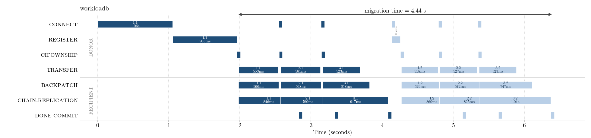

# AqRaft RDMA Reshard — Production Results (async-apply)

Production migration-window results for the AqRaft RDMA reshard, run on the
CloudLab cluster. Three donor shardgroups (sg1/sg2/sg3) are resharded into the
recipient shardgroup **sg4** (leader redis3, followers redis4 + ycsb1) over
**2 rounds** = 6 migration sessions, while a YCSB client drives live traffic.

Build: branch `aqueduct_broken` @ `dcb0d09a` (rdma-async-apply). All optimizations
are behind default-off flags; this run enables the full validated stack.

## Configuration

| Parameter | Value |
|---|---|
| Rounds | 2 (3 donors/round → 6 sessions) |
| Backpatch worker pool | 4 (`rdma-backpatch-pool-size`) |
| Chain pipeline (drip forward) | on (`rdma-chain-pipeline`) |
| Cross-session dispatch + 3-pool ring | on (`rdma-chain-xsession`) |
| Async-apply (commit before merge) | on (`rdma-async-apply`) |
| Peer stagger | 0 (completion-driven dispatch) |
| Dataset | YCSB `recordcount=500000`, ~1 KB records |

## Results

| Workload | Migration window (cold-excluded) | Slots migrated | Commits | Data integrity | Crash |
|---|---|---|---|---|---|
| **workloada** (50/50 r/w) | **4.52 s** | 4095 (682/683 × 3) | 6/6 | reads all `Return=OK` | none |
| **workloadb** (95/5 r/w) | **4.45 s** | 4095 (682/683 × 3) | 6/6 | reads all `Return=OK` | none |

Window = sg1 FLIPPING → last donor DONE (excludes the cold sg1 CONNECT+REGISTER
prep, which is off the critical path). Both workloads land at ~4.5 s: the
migration is data-volume-bound at the recipient, not workload-bound.

## Figures

Phase Gantt — X = time (s), Y = phase lanes, bars = donor sessions `sg<donor>.<round>`
(navy = round 1, light blue = round 2). DONOR lanes (CONNECT/REGISTER/CH_OWNSHIP/
TRANSFER) above the divider; RECIPIENT lanes (BACKPATCH/CHAIN-REPLICATION/DONE COMMIT)
below.

### workloada (4.51 s)


### workloadb (4.44 s)


## How to read the lanes

- **CONNECT / REGISTER / CH_OWNSHIP** — donor-side QP setup + ownership flip. Round-1
  sg1's CONNECT+REGISTER (~1 s each) is the cold prep, excluded from the window.
- **TRANSFER** — donor RDMA-writes its 1.43 GB (682 slots × 2 MiB) into the recipient
  landing pool. ~0.52 s/session at ~22 Gbit/s (≈88% of the 25 Gbit/s link).
- **BACKPATCH** — recipient merges the landing-pool blocks into the live keyspace
  (single main-thread, serialized across sessions).
- **CHAIN-REPLICATION** — recipient forwards the raw blocks to F1→F2. Drawn from
  session start to show its full pipelined span (~0.8–1.0 s); it overlaps the merge,
  so only ~0.25 s is exposed beyond it.
- **DONE COMMIT** — `MGN_INDX_UPD` raft commit. With async-apply this fires on
  chain-durable (commit), *before* the keyspace merge finishes; the merge drains as
  background apply.

## Reproduce

```bash
cd /users/entall/rd/ansible
# workloada
sudo ansible-playbook -i inventory.ini \
  experiments/custom_reshard_v2_orch_raft_chunked/workload_nround.yml \
  -e redis_variant=custom -e pre_reshard_pause=20 -e n_rounds=2 \
  -e rdma_backpatch_pool_size=4 -e rdma_migration_peer_stagger_ms=0 \
  -e ycsb_slotpoll_ms=100 -e rdma_chain_pipeline=yes -e rdma_chain_xsession=yes \
  -e rdma_async_apply=yes \
  -e redis_workload=workloada_prod \
  -e experiment_name=custom_reshard_prod_drip_workloada
# workloadb: swap redis_workload=workloadb_prod and the experiment_name suffix

# regenerate a figure from a run:
cd /users/entall/rd
python3 plot_phase_gantt.py /tmp/experiments/<experiment_name> \
  ansible/plots_20260609_prod/phase_gantt_prod_drip_<workload>.png
```

Note: source edits must be rsynced to redis1–4 + ycsb1 then built via
`tasks/build/build_redis_custom.yml` (run as root) before a run picks them up.

## Notes on the remaining cost

The ~4.5 s window is dominated by the **6 serial transfers** (~3.1 s of RX at the
recipient's single 25 Gbit/s NIC) plus the ~0.8 s round-2 reconnect and the
first-flip/last-commit tails. The merge and chain are off the window (background /
overlapped). The largest untapped lever is that each 2 MiB block is only ~1.3% full
(~30 keys/slot of the 500 K-key dataset), so the migration moves ~70× more bytes
(zero-padding) than the ~114 MB of real data — shrinking the block or sending
variable-length payloads would cut transfer + chain dramatically.
